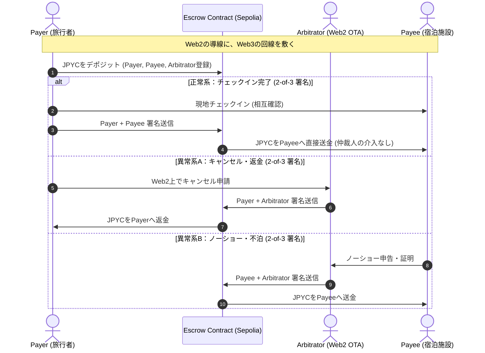

# escrowtest

Smart contract test

今回、エスクローを行うにあたって、テストネットに以下のスマートコントラクトを書いた。

[リンク](https://sepolia.etherscan.io/address/0x654d644d6cc1e1f74c0ce3ad9958487ef6446fdf)

これは、このスマートコントラクトの実験用のコードである。

## What for


# Web2の導線にweb3の回線を敷く

一般的にステーブルコイン決済はP2Pを意識しがちだが、web2のもっとも重要な業務である「調停」の部分を欠いている。
調停とはその業務が正式に履行されたか、キャンセルするか、キャンセルしたとして何割の返金を行うかといった業務である。
本スマートコントラクトは、支払者、受取者、調停者（ここではプラットフォームを意味する）の2of3での署名で処理を実行する
エスクローのスマートコントラクトである。

このコントラクトを通して、web2プラットフォームのような調停者は存在するが、カストディを行わないエスクローを行うことができ、
日本のような厳しいカストディ規制のある国でもweb2プラットフォーム型web3決済を実行できる可能性を持つ。

## Diagram


enum Action {
        DONE,   // 正常完了（Payeeへの全額送金）
        REFUND, // 割合指定キャンセル（PayerとPayeeで分割）
        CANCEL  // 完全キャンセル（Payerへの全額返金）
    }
```
チェックインといった正規の取引成立の場合、DONEで支払者、受取者の2of3の署名で実行する。<br>
中途キャンセルの場合、REFUNDでアロケーションを設定し、支払者、調停者の2of3で返金処理を実行する<br>
受取者都合のキャンセルの場合、CANCELで受取者、調停者の2of3署名でキャンセルを実行する。<br>

```
function createEscrow(
        bytes32 escrowId,
        address payee,
        address relayer,
        address token,
        uint256 amount,
        uint256 deadline
    )
```

escrowIdを任意に作成し、payee、relayer(ここではArbitatorとも称する)を指定、<br>
支払うERC20トークンと数量を指定し、のちに説明するclaimAfterDeadlineのための締め切り時間（deadline UNIX時間）を設定する。<br>
この署名をpayerが行うことで、コントラクトに資金が預けられる。<br>


```
function signExecute(
        bytes32 escrowId,
        Action action,
        Allocation[] calldata allocations
    )
```
Actionの対応、並びにAllocationを返金率等は、web2のプラットフォームを通して作成し、2of3の署名を集めることができたらsignExecuteの通り実行とする。


```
function claimAfterDeadline(bytes32 escrowId)
```
締め切りを過ぎたコントラクトは、これで支払者に全額送金とする。